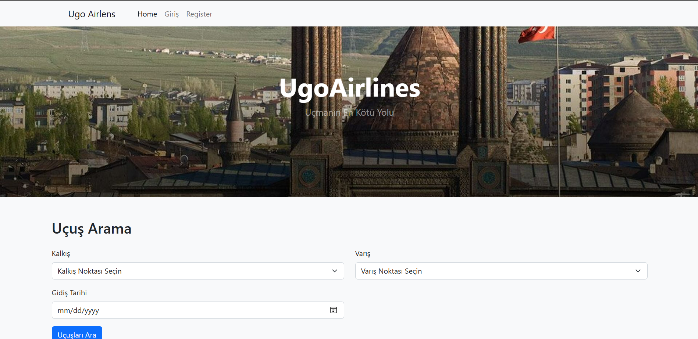

# THY_3 Django Projesi




Bu proje, **THY_3** adlı bir Django web uygulamasıdır. Bu belge, projeyi nasıl kuracağınızı ve çalıştıracağınızı açıklar.

## Gereksinimler

- Python 3.10
- Django
- Diğer bağımlılıklar için `requirements.txt` dosyasına bakın

## Kurulum

### 1. Proje Klasörüne Git

PowerShell veya Komut Satırını açın ve aşağıdaki komutları çalıştırın:

```sh
cd 'proje_klasörünün_yolu'
```

### 2. Bağımlılıkları Yükleyin

Eğer proje bağımlılıkları eksikse, şu komut ile yükleyebilirsiniz:

```sh
pip install -r requirements.txt
```

### 3. Veritabanını Yükleyin

1. **SSMS’yi açın** ve **SQL Server’a bağlanın**.
2. **Object Explorer** panelinde **Databases** üzerine sağ tıklayın ve **Restore Database…** seçeneğini seçin.
3. **Source** kısmında **Device** seçeneğini işaretleyin ve `...` (göz at) butonuna tıklayın.
4. **Add...** butonuna basın ve `thy_1.bak` dosyanızın bulunduğu konumu seçin.
5. **OK** butonuna tıklayın ve **Verify Backup Media** seçeneğini işaretleyin.

### 4. Geliştirme Sunucusunu Başlatın

Geliştirme sunucusunu başlatmak için aşağıdaki komutu çalıştırın:

```sh
python manage.py runserver
```

### 5. Tarayıcıdan Projeyi Kontrol Edin

Django projesinin çalıştığını kontrol etmek için tarayıcıdan şu adrese gidin:

```sh
http://127.0.0.1:8000/
```

---

## 📂 Proje Yapısı

```
THY_3/
│── manage.py            # Django yönetim komutu dosyası
│── requirements.txt     # Proje bağımlılıklarını listeleyen dosya
│── THY_3/              # Ana Django uygulama dizini
│   │── settings.py      # Django ayarları
│   │── urls.py          # URL yönlendirmeleri
│   │── wsgi.py          # WSGI uygulama dosyası
│── wbst/               # Web sitesi uygulaması
│   │── models.py        # Veritabanı modelleri
│   │── views.py         # Görünümler
│   │── urls.py          # URL yönlendirmeleri
│   └── templates/      # HTML şablonları
```
